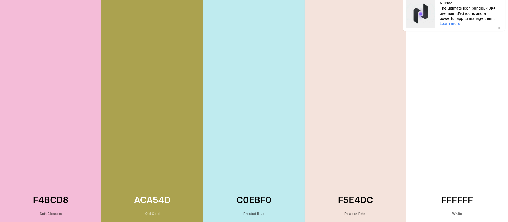
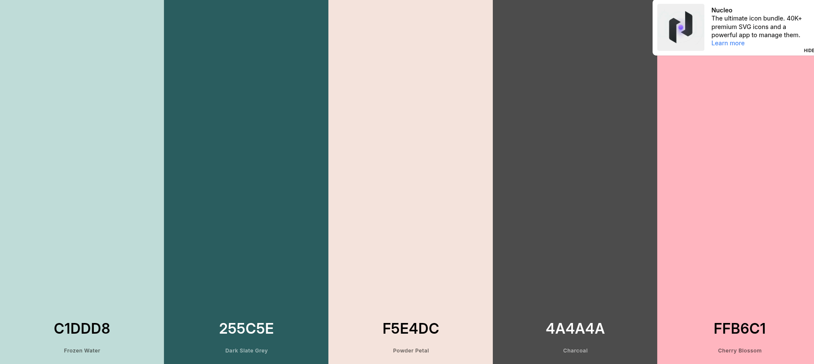
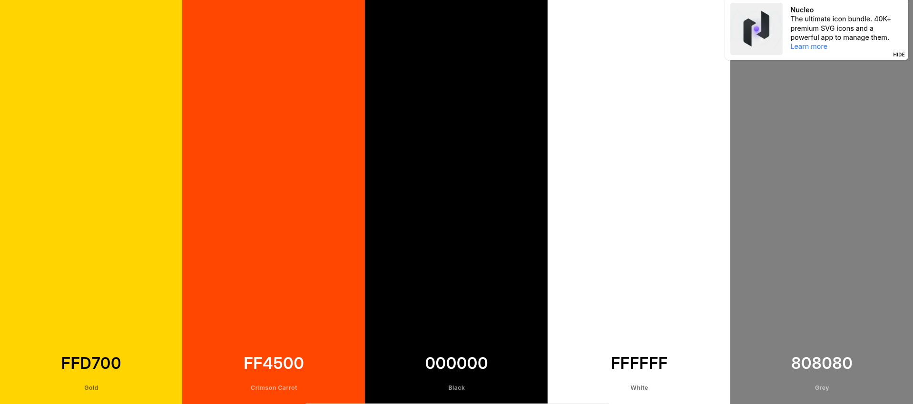

Como parte de la investigación, busqué qué colores se usan en los sitios que visitan las mamás para ver si hay algún patrón o estilo que les guste más. 

### Sitios investigados y sus colores

**1. Motherly**
Es un sitio muy popular de maternidad con una estética bien cuidada y tranquila.
- #F4BCD8 (Rosa empolvado)
- #ACA54D (Verde oliva)
- #C0EBF0 (Celeste claro)
- #F5E4DC (Arena/Beige cálido)
- #FFFFFF (Blanco puro)

https://www.mother.ly/

**2. BabyCenter**
Es de los sitios más conocidos para temas de embarazo y bebés. Usan colores que dan confianza pero se ven modernos.
- #C1DDD8 (Verde agua suave)
- #255C5E (Azul grisáceo)
- #F5E4DC (Tono arena para fondos)
- #4A4A4A (Gris oscuro para texto)
- #FFB6C1 (Rosa claro para detalles)

https://www.babycenter.com/

**3. Scary Mommy**
Este sitio es diferente porque tiene un enfoque más realista y con humor, por lo que sus colores son más fuertes.
- #FFD700 (Amarillo vibrante)
- #FF4500 (Naranja/Rojo)
- #000000 (Negro para resaltar)
- #FFFFFF (Blanco)
- #808080 (Gris neutral)

Aunque los tonos parezcan muy saturados, el truco de scarry mommy es que usa mucho el blanco y el gris, de esa forma la pagina no se siente saturada y más bien da la sensación de la paleta de colores que tendría una guardería o juguetes de niño 

https://www.scarymommy.com/

---

### ¿Qué aprendí de esta investigación?

Me di cuenta de que la mayoría de sitios para mamás están dejando de usar solo el "celeste para niños y rosa para niñas". Ahora se usan mucho los tonos tierra, beige y verdes suaves porque transmiten más calma y se sienten más naturales. La tendencia actual es el "minimalismo cálido", que busca que la mamá se sienta en un ambiente relajado y no tan saturado.

Sin embargo, sitios como Scary Mommy demuestran que también les gustan los colores fuertes y con energía cuando el contenido es más honesto o divertido. En resumen, para un diseño que busque relajar (como lo que vimos antes con las sensaciones de las madres), lo mejor es irse por la paleta de tonos pasteles y tierra, ya que ayudan a bajar el estrés, pero si buscamos algo más divertido podríamos usar paletas más vibrantes y contrastantes. 
