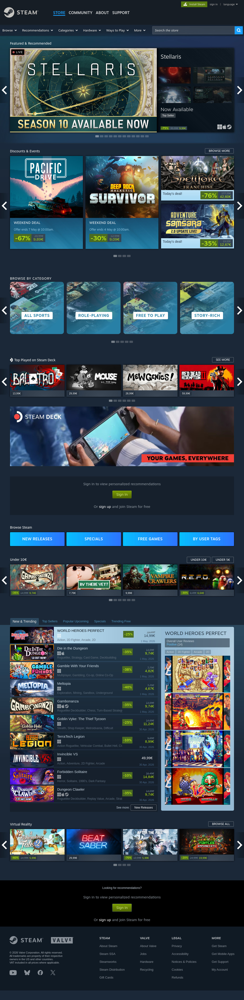
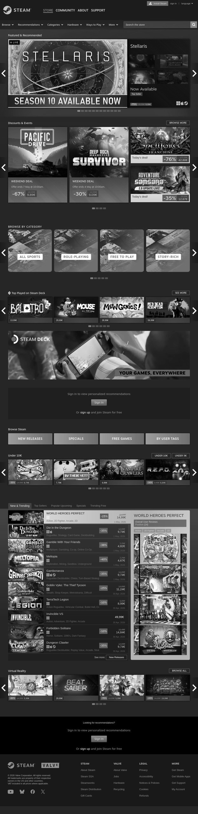
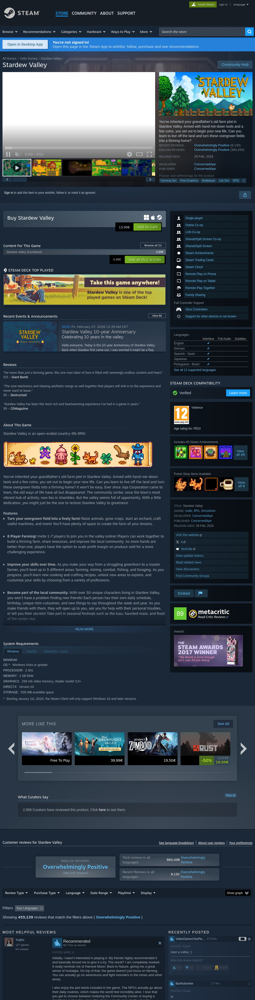
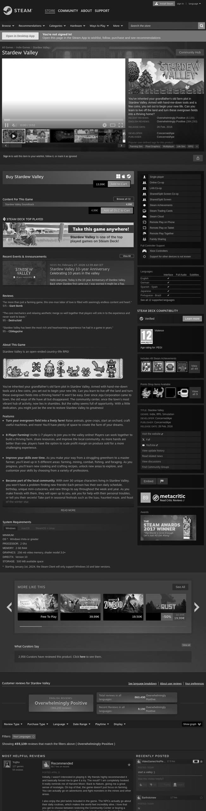

Para poder rediseñar el sitio, primero analicé los elementos que componen la página de Steam sin dejarme llevar por los colores actuales. Para esto, usé capturas de pantalla en blanco y negro de la tienda principal y de la página de Stardew Valley.

### Capturas de pantalla de la interfaz

#### Tienda principal
Original:

Blanco y negro:

#### Página de juego (Stardew Valley)
Original:

Blanco y negro:

---

### Elementos identificados

Al analizar las páginas de esta forma, pude identificar los siguientes elementos principales que deben tener un color asignado en el rediseño:

1. **Barra de navegación superior:** Es donde están los menús principales como Tienda, Comunidad y el Perfil.
2. **Barra de búsqueda:** Elemento clave para encontrar juegos rápidamente.
3. **Banner principal (Carrusel):** Es el elemento más grande de la tienda donde se muestran las novedades.
4. **Categorías laterales:** Menú de la izquierda que ayuda a filtrar por géneros o etiquetas.
5. **Título del juego:** El texto principal que identifica el producto.
6. **Botón de compra / Precio:** Es el elemento de acción más importante (CTA).
7. **Botón de añadir a deseados:** Una acción secundaria pero muy común.
8. **Calificación de reseñas:** Indica qué tan bueno es el juego según la comunidad.
9. **Galería de imágenes:** Capturas y videos que muestran cómo se ve el juego.
10. **Etiquetas del juego:** Palabras clave que definen el género (ej. Simulación, Relajante).
11. **Pie de página:** Información legal, links de ayuda y redes sociales.
12. **Botones de navegación del carrusel:** Pequeños controles para pasar las imágenes del banner.

