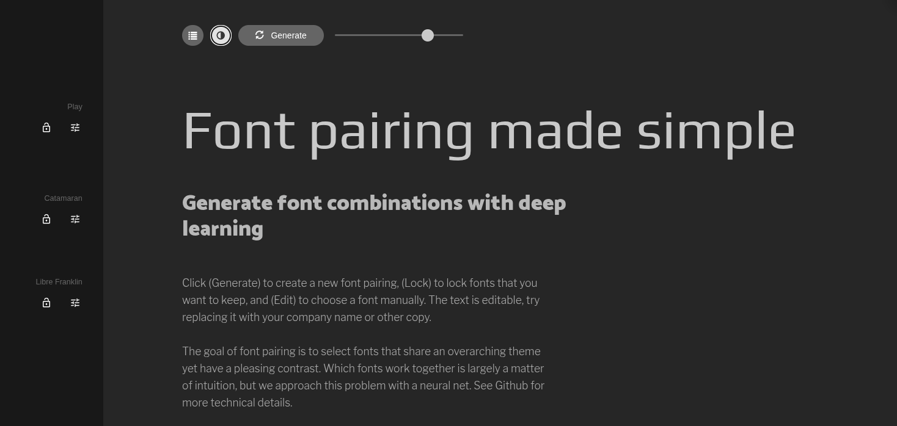
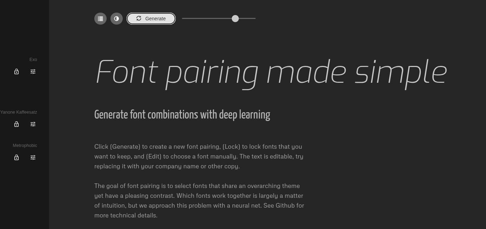
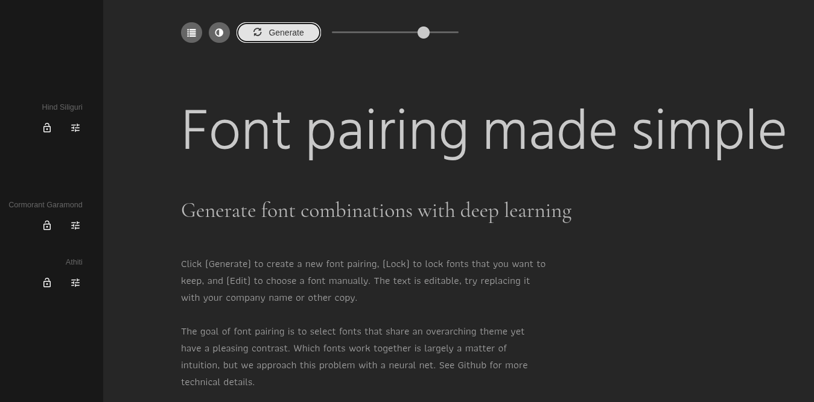

Diego Andre Calderón Salazar - 241263

Como parte del rediseño, busqué una combinación de fuentes que se sintiera más amigable y cercana para las mamás, alejándome de la tipografía estándar y técnica que tiene Steam actualmente. Hice tres pruebas de combinaciones usando Fontjoy.

### Pruebas de tipografía

**Prueba 1**

Esta combinación se sentía un poco seria y rígida, quizás demasiado formal para lo que busco.

**Prueba 2 (La que más me gustó)**

Esta es la opción elegida. Utiliza **Exo** para los títulos, **Yanone Kaffeesatz** para elementos secundarios y **Metrophobic** para el cuerpo de texto. Me gusta porque el conjunto se ve muy moderno y limpio. La fuente de los títulos tiene mucha fuerza, mientras que las otras aseguran que el sitio no se sienta cargado y sea fácil de leer.

**Prueba 3**

Esta opción era muy moderna, pero se sentía un poco fría, similar a lo que ya tiene Steam.

---

### Emociones de la combinación elegida

Al ver las fuentes de la **Prueba 2** en conjunto, me transmiten estas tres emociones:

1. **Modernidad:** Las tres fuentes son "sans-serif" y tienen un estilo muy actual que hace que el diseño se sienta renovado.
2. **Claridad:** Son fuentes muy limpias que ayudan a que la interfaz no se vea desordenada, algo que ayuda a bajar el estrés visual.
3. **Energía:** Especialmente por Yanone Kaffeesatz y Exo, que tienen un estilo estilizado que transmite que la plataforma es activa y emocionante.

### ¿Por qué elegí estas fuentes?

Elegí esta combinación porque **Exo** le da un toque tecnológico pero amigable a los títulos principales. **Yanone Kaffeesatz** es excelente para resaltar información secundaria (como categorías o botones pequeños) porque es una fuente condensada que ahorra espacio sin perder legibilidad. Finalmente, **Metrophobic** funciona muy bien para los párrafos y descripciones largas porque es muy equilibrada y cómoda para la vista, lo que es clave para que las madres puedan navegar por la tienda sin cansarse.

