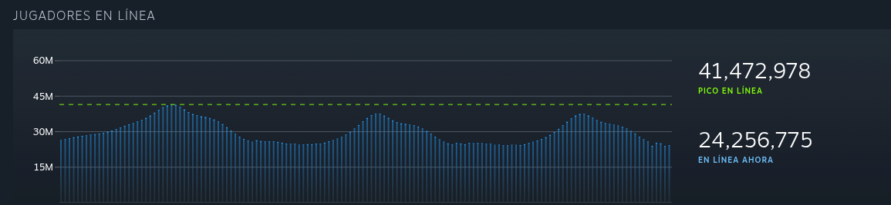
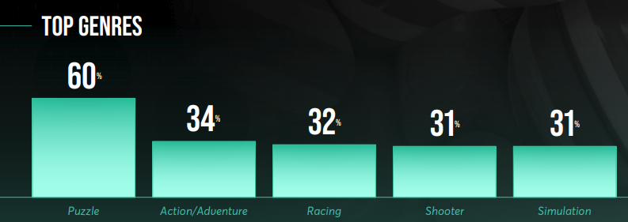
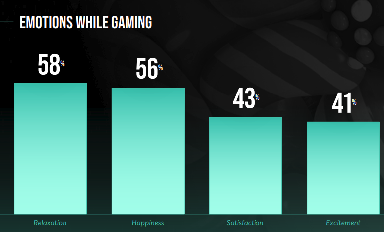

Diego Andre Calderón Salazar - 241263 

Con el paso de los años, los videojuegos se han convertido cada vez más en parte constante del diario colectivo en las sociedades modernas. 

Por este motivo, en nuestros tiempos existen perfiles de todo tipo que disfrutan de jugar videojuegos, desde los más pequeños hasta los más adultos. 

Para este proyecto, nos interesa conocer las preferencias de las madres que juegan videojuegos, y cómo podemos hacer más accesible algunas de las plataformas de videojuegos como es el caso de steam. 

En esta pequeña investigación se registran algunas estadísticas útiles para analizar la integración de las madres y amas de casa en la industria de los videojuegos, destacando su peso demográfico, económico y social a nivel global y regional. 

### 1. Estadísticas Globales y Demografía

El segmento de madres jugadoras ha pasado de ser un nicho a representar una mayoría silenciosa del mercado.

- **Participación:** El **87%** de las madres se identifican como jugadoras activas.
    
- **Representación:** **1 de cada 5** jugadores en el mundo es una mujer con hijos (20% del mercado total).
    
- **Fidelidad:** El **57%** ha jugado por más de 10 años, indicando un hábito consolidado.
    
- **Frecuencia:** El **75%** juega semanalmente y el **38%** diariamente.
    

### 2. Plataformas y Comportamiento de Consumo

Aunque el móvil lidera por accesibilidad, el perfil es multiplataforma y sofisticado.

|**Plataforma**|**Uso Mensual (Madres)**|**Motivación Principal**|
|---|---|---|
|**Móvil**|94%|Inmediatez y descompresión rápida.|
|**Consolas**|76%|Experiencias inmersivas (PS5, Nintendo Switch).|
|**PC**|58%|Estrategia y socialización avanzada.|

- **Tiempo promedio:** 35 minutos diarios de sesión.
    
- **Géneros:** Evolución desde puzzles y simulación hacia acción, aventura y _shooters_.
    

---

### 3. Contexto Regional: Latinoamérica y Guatemala

La región muestra una de las paridades de género más altas del mundo en el sector.

- **Latinoamérica:** El **49.7%** de los jugadores son mujeres. Se proyecta un crecimiento del mercado del **9.3% (CAGR)** hasta 2030.
    
- **Guatemala:**
    
    - **Conectividad:** 60.8% de penetración de internet; el **98.8%** de los accesos son móviles.
        
    - **Uso social:** Las amas de casa utilizan el gaming y redes sociales (WhatsApp/Facebook) para mitigar el aislamiento y gestionar el hogar.
        

---

### 4. Impacto Psicosocial y Familiar

El videojuego cumple funciones que trascienden el ocio básico.

- **Salud Mental:** El **81%** lo usa para aliviar el estrés. Genera sentimientos de relajación (58%) y felicidad (43%).
    
- **Vínculo Familiar:**
    
    - **74%** afirma que el juego une a la familia.
        
    - **82%** juega activamente con sus hijos.
        
    - Facilita una mejor supervisión del contenido digital (71% monitorea lo que juegan sus hijos).
        

### 5. Potencial Económico y Barreras

Las madres gamers poseen un perfil de consumo más activo que las no jugadoras.

- **Poder de decisión:** Tienen mayor probabilidad de decidir compras en categorías como ropa (**73%**), cosméticos (**63%**) y muebles (**38%**).
    
- **Desafío Crítico:** El **75%** de las jugadoras en Latinoamérica ha sufrido acoso o toxicidad en línea, lo que limita su participación en comunidades abiertas.

## Referencias

https://about.ads.microsoft.com/en/blog/post/february-2024/7-facts-about-the-87-percent-of-moms-who-game

https://about.ads.microsoft.com/content/dam/sites/msa-about/global/common/content-lib/pdf/moms-got-game.pdf

https://www.aaaa.org/blog/guest-post-gamer-moms-are-redefining-the-market-heres-how-brands-can-engage/

https://about.ads.microsoft.com/en/resources/discover/insights/moms-got-game.pdf

https://www.diariolibre.com/revista/cultura/2026/01/07/el-perfil-real-del-gamer-no-es-el-que-imaginas/3396799

https://afjv.com/news/2810_majority-of-moms-play-video-games-new-report-finds.htm

https://scielo.isciii.es/scielo.php?script=sci_arttext&pid=S0212-97282022000300012

https://tvaztecaguate.com/nota-empresarial/2023/11/09/replay-guatemala-lanza-estudio-sobre-la-culturade-los-gamers-en-guatemala/

https://forbes.co/forbes-women/en-latinoamerica-el-497-de-los-gamers-son-mujeres

---

## Mom persona

# Gráficos Relevantes
## Hardware más utilizado

## Juegos más jugados entre los usuarios de Steam

Los juegos más jugados en steam, en su mayoría, son juegos de índole competitiva, pero en ciertos momentos llega a estar algún juego más individual, como lo es Slay the Spire 2 actualmente. Otro ejemplo interesante es Stardew Valley, el cual pese al tiempo desde su salida en 2016, actualmente se posiciona en el 20vo juego más jugado de la plataforma; un juego que puede ser disfrutado por cualquier tipo de persona. 

## Jugadores diarios en Steam

Como se aprecia en el gráfico, todos los días hay al rededor de 20,000,000 a 40,000,000 personas en línea en steam. 

## Crecimiento de Jugadores a lo largo de los años

Este gráfico nos demuestra el crecimiento que ha tenido steam a lo largo de los años hasta 2021, lo que demuestra como ha incrementado el uso de la plataforma a nivel mundial. 

## Géneros más jugados entre las mamas gamers

En el gráfico se observa como el principal género que disfrutan las madres gamer son los juegos de puzzle, seguido por los action/adventure y Racing. Géneros que muchas veces pueden jugarse en familia o invidualmente y resultan mayormente relajantes y divertidos. 

## Sensaciones al jugar

Las mujeres cuando juegan normalmente se sienten realjadas, felices y satisfechas, por lo tanto podríamos pensar que es la sensación que nos interesa dar con nuestro diseño. 