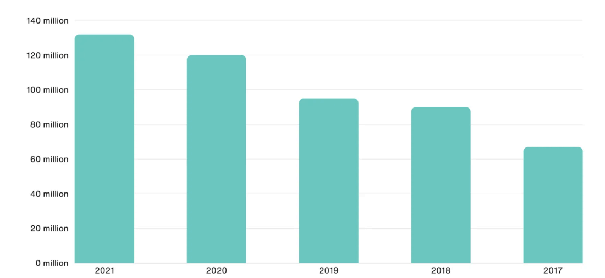
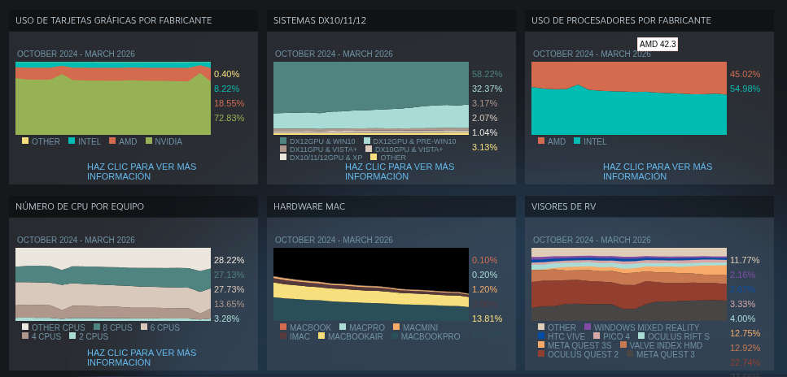
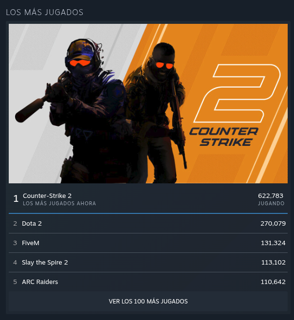
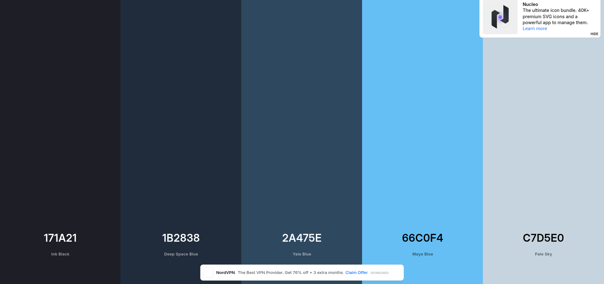

Como parte de la investigación, es necesario entender quiénes son los que realmente usan steam y qué es lo que buscan en la plataforma para comparar con el perfil de las madres gamer. 

### ¿Qué es Steam?
Steam no es una empresa, es la aplicación/plataforma de distribución de **Valve Corporation**. 

- **Misión:** Empoderar a creadores y jugadores con tecnología y plataformas abiertas.
- **Visión:** Crear un futuro de entretenimiento abierto donde el jugador sea lo principal.

---

### Estadísticas y Demografía (2024-2026)

Steam sigue creciendo y estos son los números más recientes que encontré:

- **Usuarios:** Se han alcanzado picos de hasta **42 millones** de personas conectadas al mismo tiempo. Al día entran unos **69 millones** de usuarios.
- **Edad:** La mayoría son jóvenes. El **66%** de los usuarios tienen entre **18 y 34 años**.
- **Género:** Sigue siendo una plataforma dominada por hombres (**63% - 76%**), aunque las mujeres ya representan casi un tercio del total (**24% - 37%**).
- **Regiones:** Asia es el mercado más grande con el **42%**, seguido de Europa y Norteamérica. Latinoamérica solo representa el **5%**.

---

### Gráficas de la plataforma

#### Crecimiento de usuarios

#### Hardware

#### Juegos populares

---

### Comparativa con las Madres Gamer

Hay una diferencia  clara entre el usuario promedio de steam y las mamás que investigué antes. El usuario de steam es joven, hombre y le interesan los juegos competitivos o de mucha dedicación. En cambio, las mamás juegan más que nada en el celular (94%) y buscan relajarse o pasar tiempo con sus hijos. 

Aunque el **58%** de las madres usa la PC, Steam todavía se siente como un lugar muy "pro" o competitivo. Hay una oportunidad grande si se logra que la plataforma se sienta más accesible para ellas, ya que lo que buscan es desestresarse y no tanto la competencia pura que domina los rankings actuales de la aplicación.

---

### Paleta de colores de Steam

Estos son los 5 colores que más se usan en la tienda:

1. #171a21 (Fondo oscuro principal)
2. #1b2838 (Azul marino de los menús)
3. #2a475e (Azul acero para botones)
4. #66c0f4 (Azul brillante para links y detalles)
5. #c7d5e0 (Gris claro para el texto)

### Emociones de la marca

Según la psicología del color, creo que estas son las 3 emociones principales:

1. Confianza: Los tonos azules oscuros dan seguridad, algo necesario para una tienda donde compras juegos.
2. Seriedad: Al no usar colores brillantes en la interfaz, se ve como una plataforma profesional para adultos/jóvenes y no tanto para niños.
3. Calma: El modo oscuro ayuda a que la vista no se canse y el usuario pueda pasar horas viendo juegos sin problema.

### Reflexión sobre los colores

Steam usa estos colores oscuros para que lo que realmente resalte sean los juegos. Como cada juego tiene su propio arte y colores, una interfaz negra o azul muy oscura funciona como un marco neutral que no estorba. Además, el azul siempre se asocia con tecnología, lo que encaja bien con lo que es Steam.

